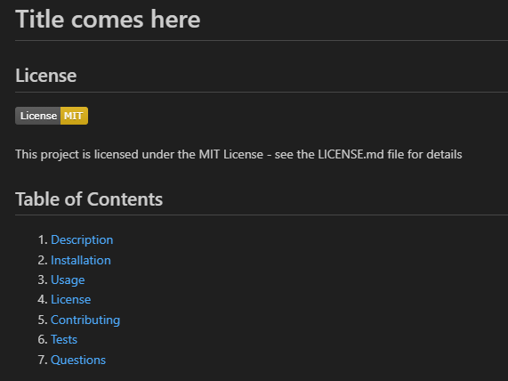

# readme-generator

## License

## Table of Contents

<ol>
<li>
<a href="#description"> Description </a>
</li>
<li><a href="#installation"> Installation </a>
</li>
<li>
<a href="#executing-program"> Executing program </a>
</li>
<li><a href="#usage"> Usage </a>
</li>
<li><a href="#credits"> Credits </a>
</li>
<li>
<a href="#tests"> Tests </a>
</li>
<li>
<a href="#screenshot-and-video"> Screenshot and Video </a>
</li>
</ol>

## Description

A command-line application to generate a README.md file from a user's input. The application uses inquirer package.

## Installation

npm inquirer@8.2.4\
run node index.js in terminal to run

## Executing program

Step 1: npm i \
Step 2: node index.js

## Usage

Readme generator to easily create a markdown file

## Credits

N/A

## Tests

Run the index.js and follow prompts.\
See if the generated README.md is created with input and links and github and email works.

## Screenshot and Video

The following video shows the application's appearance and functionality:\
Click on the image below for a video to play

